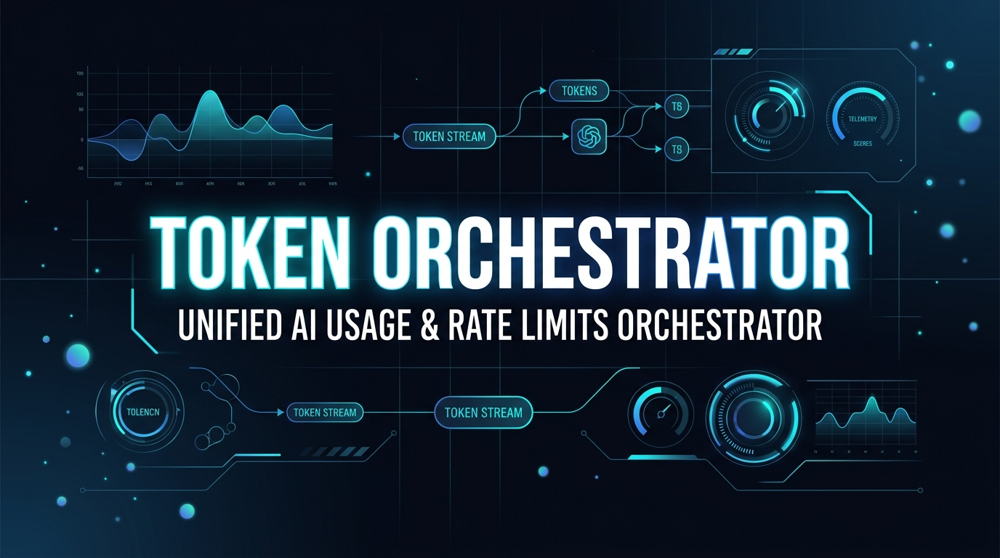
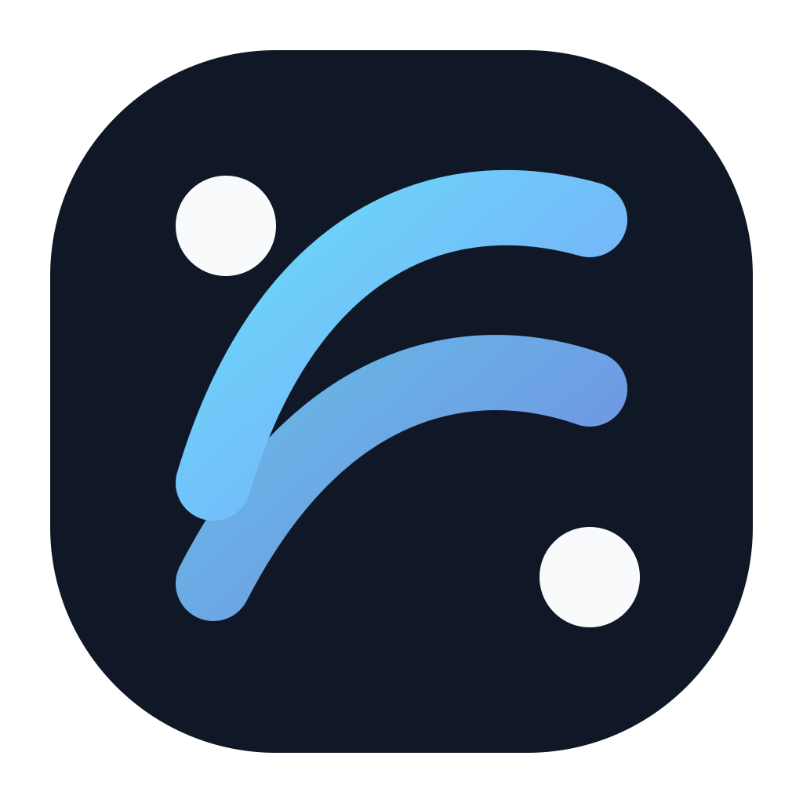
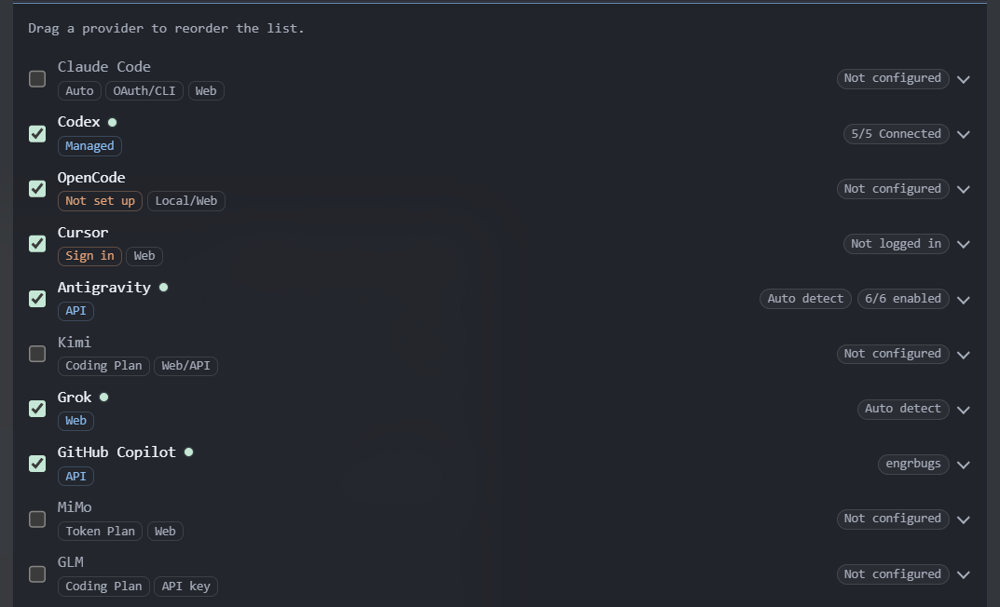
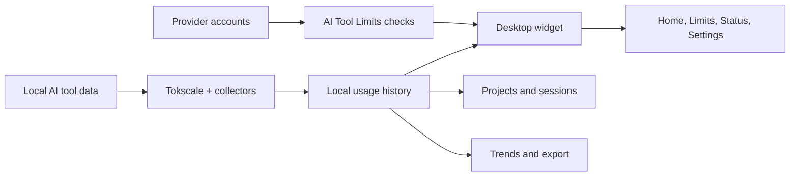

<p align="center">
  
</p>

<p align="center">
  <a href="https://engrbugs.github.io/token-orchestrator/"></a>
  <a href="https://github.com/engrbugs/token-orchestrator/releases/latest"></a>
  <a href="https://github.com/engrbugs/token-orchestrator/blob/main/LICENSE"></a>
  <a href="#supported-coverage"></a>
  <a href="#supported-coverage"></a>
  
</p>

<p align="center">
  <a href="#token-orchestrator"></a>
</p>

<h1 align="center">Token Orchestrator</h1>

<p align="center">
  <strong>Open-source, local-first control center for tracking real-time tokens, spend, and rate limits across 21+ AI coding tools.</strong>
</p>

<p align="center">
  <a href="https://engrbugs.github.io/token-orchestrator/"><strong>Explore live documentation &amp; interactive showcase at engrbugs.github.io/token-orchestrator →</strong></a>
</p>

**Token Orchestrator** brings usage, cost, sessions, provider limits, multi-account quotas, and history into one quiet desktop surface. When work is spread across `Claude Code`, `Codex`, `Cursor`, `OpenCode`, `Antigravity`, `Copilot`, and other AI tools, Token Orchestrator tracks everything on your own machine with zero telemetry and zero cloud lock-in.

- **21+ Tracked Coding Clients** — automatic session log discovery with [tokscale](https://www.npmjs.com/package/tokscale)
- **19+ Live Limits & Quotas** — 5-hour rolling windows, daily resets, credit balances, and multi-account Antigravity & Codex switching
- **100% Local-First & Private** — filesystem `0600` credentials, zero prompt logging, and no external tracking
- **Flexible Presentation Modes** — full desktop widget, OS system tray menu, and floating HUD bubble
- **3 Deployment Topologies** — standalone local desktop app, headless collector agent (`npm run agent`), or self-hosted Node hub (`npm run hub`)

<table>
  <tr>
    <td align="center" valign="top" width="50%">
      <br />
      <sub><strong>AI Tool Limits</strong> — multi-account quotas at a glance</sub>
    </td>
    <td align="center" valign="top" width="50%">
      <br />
      <sub><strong>Provider setup</strong> — enable tools, accounts, and connection status</sub>
    </td>
  </tr>
</table>

### Download for Windows

The current stable Windows build is available on the [v0.39.0 release page](https://github.com/engrbugs/token-orchestrator/releases/tag/v0.39.0) with installer and portable downloads.

## What it does

- Collects local usage and cost data through [tokscale](https://www.npmjs.com/package/tokscale)
- Shows sessions, projects, model breakdowns, daily history, and trends
- Checks supported AI Tool Limits, including multiple Codex and Antigravity accounts
- Supports provider-specific account and API-key management
- Offers desktop, tray, and floating presentation modes where supported
- Keeps the core usage view local-first, with network requests limited to enabled provider checks, update checks, public status/exchange-rate data, or explicitly enabled integrations
- Exports usage data as CSV or JSON

The goal is visibility, not surveillance: see your own development activity clearly without sending it to a Token Orchestrator-hosted service.

## How it works



Usage collection and presentation are separate from provider-limit checks. That means the local usage view can remain useful even when a provider is not signed in or its limits endpoint is unavailable.

## Getting started

### Requirements

- Windows, macOS, or Linux
- Node.js 22.13.0 or newer
- npm

### Run from source

```bash
git clone https://github.com/engrbugs/token-orchestrator.git
cd token-orchestrator
npm install
npm start
```

Open Settings to choose the clients to track, configure provider accounts, and select the limits you want to check. The default collection list is documented in [src/shared/clientTracking.js](src/shared/clientTracking.js).

### Environment configuration

Copy [.env.example](.env.example) to .env only when you need environment-managed settings, the headless agent, or sync mode. The desktop widget can be used in single-device local mode without a hub.

Keep secrets out of commits. The widget stores its local settings and credentials in the platform user-data directory, for example:

- Windows: %APPDATA%\\Token Orchestrator
- macOS: ~/Library/Application Support/Token Orchestrator
- Linux: the normal Electron user-data directory

## Supported coverage

Token usage, session details, and AI Tool Limits are tracked independently. Availability can vary by client, account type, operating system, and provider API.

| Tool or provider | AI Tool Limits |
| --- | :---: |
| Claude Code | ✅ |
| Codex | ✅ |
| OpenCode | ✅ |
| Cursor | ✅ |
| Antigravity | ✅ |
| Kimi | ✅ |
| Grok Build | ✅ |
| GitHub Copilot | ✅ |
| MiMo Code | ✅ |
| ZCode / GLM | ✅ |
| Kiro | ✅ |
| DeepSeek | ✅ |
| OpenRouter | ✅ |
| Minimax | ✅ |
| Volcengine | ✅ |
| Qoder | ✅ |
| Ollama | ✅ |
| Third-party APIs | ✅ |

“Supported” means the repository contains a provider adapter and limit-checking path; it does not guarantee that every account or plan exposes every metric.

## Build a stable local demo

The project is an Electron desktop application. The fastest reproducible packaging check is:

```bash
npm install
npm run pack
```

That creates an unpacked Windows build in dist/win-unpacked/. For distributable Windows artifacts, use:

```bash
npm run dist:win
```

The release configuration also defines macOS and Linux targets. Code-signing credentials and provider-specific release requirements are intentionally separate from the source checkout; see [docs/code-signing.md](docs/code-signing.md).

## Development checks

```bash
npm test           # node:test suite
npm run lint       # ESLint
npm run verify     # lint + tests
```

For a collector dry run that does not post data:

```bash
node src/agent/agent.js --once --dry-run
```

The headless agent and standalone hub remain available for compatibility and sync-oriented setups. The desktop app does not require them for single-device local use.

## Data and privacy

Token Orchestrator does not operate a hosted usage-collection service. Network requests are limited to documented or user-enabled features: provider checks, update checks, public status/exchange-rate data, and explicitly enabled Discord or sync integrations.

Read the details in:

- [Privacy](docs/privacy.md)
- [Data export](docs/export.md)
- [GitHub Copilot CLI tracking](docs/github-copilot-otel.md)
- [Code signing](docs/code-signing.md)

## Project shape

- src/electron/ — Electron main process, renderer, tray, floating window, and settings UI
- src/shared/ — collectors, provider adapters, history, limits, credentials, and exports
- src/agent/ — optional headless collection
- src/hub/ — optional sync hub
- tests/ — behavior and presentation tests
- assets/application-main.png — redacted Limits overview screenshot
- assets/application-settings-limits.png — provider account setup screenshot

Token Orchestrator is a practical observability layer for AI-assisted development: local enough to trust, broad enough to be useful, and explicit about where provider-specific data comes from.

## Acknowledgments

This project acknowledges [Javis603/token-monitor](https://github.com/Javis603/token-monitor) as the base and stripped-down foundation for Token Orchestrator, and [erennyuksell/ag-multi-account-switchboard](https://github.com/erennyuksell/ag-multi-account-switchboard) for Antigravity bug fixes and multi-account switching work.
This project is maintained in the [engrbugs/token-orchestrator](https://github.com/engrbugs/token-orchestrator) repository.

## License

[MIT](LICENSE)
