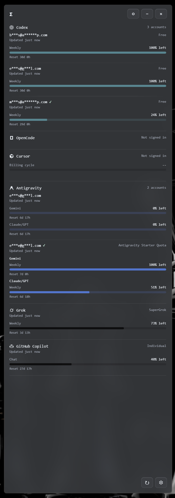

# Token Orchestrator

Token Orchestrator is a local-first desktop companion for AI coding usage, provider limits, and account management.

## Current app

The widget provides:

- Local usage and cost collection through `tokscale`
- AI Tool Limits for supported providers, including multiple Codex and Antigravity accounts

The app has no system-tray icon. Usage collection continues in the background while the widget is open or minimized.

Supported client and provider identifiers are maintained in the code and in [`.env.example`](.env.example).



## Getting started

Clone or update the repository, install dependencies, and start the widget:

```bash
git clone https://github.com/engrbugs/token-orchestrator.git
cd token-orchestrator
npm install
npm start
```

For an existing checkout, use `git pull` before `npm install`. Then open Settings
to configure tracked clients, provider limits, and credentials.

The desktop widget is local-only. The legacy headless agent and standalone hub remain available as separate command-line utilities; configure them from [`.env.example`](.env.example).

### Collection defaults

The Collection settings control which client data is scanned. The default list
is defined in `src/shared/clientTracking.js`; the current defaults include
Claude Code, Codex, OpenCode, Hermes, OpenClaw, Cursor, Antigravity, Cline,
Kimi, Qwen, Grok, GitHub Copilot, Pi, Zed, Kilo Code, ZCode, Kiro, CodeBuddy,
WorkBuddy, and Proma. MiMo Code is available in Settings but is opt-in because
its database can import Claude sessions and cause double-counting. Removing a
client stops new collection and removes that client from the usage breakdown;
previously collected usage data is not rewritten.

### Supported AI Tool Limits

The following tools support AI Tool Limits checks. Token usage and session-detail
support are tracked separately.

| Tool | AI Tool Limits |
| --- | :---: |
| Claude Code | ✅ |
| Codex | ✅ |
| OpenCode | ✅ |
| Cursor | ✅ |
| Antigravity | ✅ |
| Kimi | ✅ |
| Grok Build | ✅ |
| GitHub Copilot | ✅ |
| MiMo Code | ✅ |
| ZCode / GLM | ✅ |
| Kiro | ✅ |
| DeepSeek | ✅ |
| OpenRouter | ✅ |
| Minimax | ✅ |
| Volcengine | ✅ |
| Qoder | ✅ |
| Ollama | ✅ |
| Third-party APIs | ✅ |

## Data locations

Application data is stored under the platform's normal user-data directory for
Token Orchestrator (for example, `%APPDATA%\\Token Orchestrator` on Windows and
`~/Library/Application Support/Token Orchestrator` on macOS). This includes
`settings.json`, `credentials.json`, collector state, and managed account data.
The location can be overridden for shared collector data with
`TOKEN_MONITOR_SHARED_DIR`.

## More docs

- [Privacy](docs/privacy.md) — network behavior and what stays local
- [Data export](docs/export.md) — CSV/JSON export from Settings → Collection
- [GitHub Copilot CLI tracking](docs/github-copilot-otel.md) — OTel setup for the standalone CLI
- [Code signing](docs/code-signing.md) — Windows Authenticode / SignPath policy

## Development

Requirements: Node.js 22.13 or newer.

```bash
npm install
npm start          # Electron widget
npm test           # node:test suite
npm run lint       # ESLint
npm run verify     # lint + tests
```

For a collector dry run without posting data:

```bash
node src/agent/agent.js --once --dry-run
```

## Acknowledgments

This project is maintained in the [engrbugs/token-orchestrator](https://github.com/engrbugs/token-orchestrator) repository.

## License

MIT

<!-- repo-activity-bump: 2026-08-04T19:08:49Z -->
